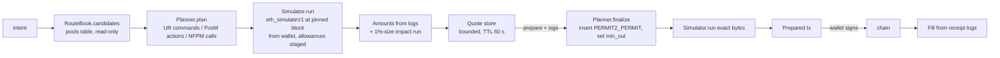

# TxRouter: swaps, fees and LP through Robinhood's UniversalRouter, no new contracts

Candidate 1 of arena `tx`. Scope: TOKEN_PLAN units 4–5 (shared transaction core, trade ticket, LP panel).

## Problem

rhpools must let a token holder buy and sell any indexed token (V2, Uniswap V3, hookless V4 and Pons‑hooked V4 pools) and mint/increase/decrease/collect LP positions, from a server that never signs, on a stdlib `ThreadingHTTPServer` with vanilla JS and a strict CSP. Every transaction must be built server‑side, simulated at a pinned block from the user's own address, carry min‑out and a deadline, use exact‑amount Permit2 approvals with expiry, and collect an atomic 75 bps rhpools fee to an owner‑configured recipient. The non‑obvious parts: Robinhood's UniversalRouter (UR) is a fork whose swap inputs carry a `minHopPriceX36` field (stock SDK bytes revert or mis‑decode), Pons pools charge two extra afterSwap fees that the ticket must itemise, the 652 GB market SQLite may only be *read*, and the existing `ActionService` already fixes the shape of an unsigned‑transaction service (`simulate` → bound quote record → `prepare` re‑preflight → wallet signs).

Everything below relies on facts that were executed on an anvil fork of the local Nitro node (block 74,145,459–74,145,468, 2026‑09‑27) by `harness/ur_probe.py`, `harness/lp_probe.py`, `harness/bridge_probe.py`; the fact table at the end says which line proves what.

## Usage (caller's view)

### Quickstart (what an implementer reads)

```
rhpools tx core: three verbs, one record.

  quote   POST /api/tx/quote    intent          -> Quote   (pinned block, amounts, fee breakdown, steps)
  prepare POST /api/tx/prepare  quote_id+sigs   -> Prepared (the exact unsigned tx, freshly re-simulated)
  receipt GET  /api/tx/receipt  hash            -> Fill    (what actually happened, reconciled from logs)

An intent is either a SwapIntent (buy/sell a token against ETH, WETH or USDG) or an LpIntent
(mint/increase/decrease/collect on a V3 NFPM or the V4 PositionManager). The server routes,
encodes, simulates and re-simulates; the browser only signs what it is handed (EIP-1193
eth_sendTransaction / eth_signTypedData_v4). Gate: `trade` for swaps, `lp` for LP intents.
```

### Call site 1: server route (lp_server.py)

```python
# do_POST, after the existing same-origin/JSON/body checks. Gating adds a branch; anonymous
# routes are untouched. `gate.require` is the sibling gate unit's contract (raises GateDenied -> 403).
elif path == "/api/tx/quote":
    wallet = self.runtime.gate.require(self, feature=_feature_for(payload))   # "trade" | "lp"
    result = self.runtime.tx.quote(parse_intent(payload, wallet)).to_json()
elif path == "/api/tx/prepare":
    wallet = self.runtime.gate.require(self, feature=None)                    # any signed-in holder
    result = self.runtime.tx.prepare(payload["quote_id"], wallet, Signatures.parse(payload)).to_json()
```

### Call site 2: trade ticket (static/tx_ticket.js)

```js
const quote = await api.post("/api/tx/quote", { kind: "swap", side: "buy", token, quote_currency: "USDG",
                                               amount_in: "250", slippage_bps: 100 });
render(quote);                                   // fee breakdown, impact, expiry countdown, warnings
// steps: [{kind:"approve", tx}, {kind:"permit", typed_data}, {kind:"send"}] — in order, each optional
for (const step of quote.steps) {
  if (step.kind === "approve") await wallet.sendAndAwait(step.tx);          // exact-amount ERC20 -> Permit2
  if (step.kind === "permit")  sigs.permit = await wallet.signTypedData(step.typed_data);
}
const prepared = await api.post("/api/tx/prepare", { quote_id: quote.quote_id, permit_signature: sigs.permit });
const hash = await wallet.send(prepared.transaction);                        // ONE swap tx
track(hash, quote);                                                          // pending -> confirmed(Fill) | failed
```

### Call site 3: LP panel (static/tx_lp.js)

```js
const q = await api.post("/api/tx/quote", { kind: "lp", op: "mint", pool_id, tick_lower, tick_upper,
                                           amount0: "0.5", amount1: "1300", slippage_bps: 50 });
// q.refusal === "hook_blocked_add" renders the refusal state; otherwise same step loop as the ticket.
```

### Call site 4: fork test (tests/test_tx_fork.py)

```python
core = TxCore(rpc=ForkRpc(url), routes=RouteBook(store_reader), policy=TxPolicy(fee_bps=75, fee_recipient=FEE_TO))
quote = core.quote(SwapIntent(wallet=USER, side=Side.BUY, token=ITH, quote_currency=USDG, amount_in=500_000_000, slippage_bps=100))
prepared = core.prepare(quote.quote_id, USER, Signatures(permit=sign(quote.step("permit").typed_data)))
fill = core.receipt(fork.send(prepared.transaction), USER)
assert fill.rhpools_fee.amount == 500_000_000 * 75 // 10_000 and fill.amount_out >= quote.min_out
```

## Shape

### Data structures (domain, never wire)

```
Currency        = 20-byte address; NATIVE = 0x0 (V4 native ETH). WETH/USDG pinned in tx_chain.
Venue           = V2 | V3 | V4
Pool            = frozen: venue, id, address, token0, token1, fee_ppm, tick_spacing, hook, factory
                  (one row of the market `pools` table, parsed; V4 pools carry a PoolKey).
HookPolicy      = NONE | PONS(hook_fee_bps, creator_tax_bps)   # from launches(poolId) w10, w7; cached per pool
Hop             = (pool, currency_in, currency_out)            # currencies may be NATIVE/WETH; planner wraps
Route           = tuple[Hop, ...]                              # ≤ 2 hops + implicit wrap/unwrap
FeeLeg          = INPUT | OUTPUT                               # buy -> INPUT (quote ccy), sell -> OUTPUT (quote ccy)
Plan            = to, value, commands: bytes, inputs: list[bytes], deadline, permit: PermitNeed | None,
                  approvals: list[ApprovalNeed], min_out_slot: (command_index, field)   # where min_out lives
Amounts         = amount_in, pool_out, hook_fee, creator_tax, rhpools_fee, net_out, min_out, impact_bps
Quote           = quote_id, wallet, intent, route, plan (min_out unset), amounts, block(number, hash),
                  expires_at, deadline, steps, warnings, refusal | None
Signatures      = permit: bytes | None
Prepared        = transaction (from,to,data,value,chainId,gas), simulation(gas), expires_at
Fill            = hash, block, status, amount_in, amount_out, rhpools_fee, hook fees, gas_native
```

Invariants encoded in types: `Route` hops are contiguous (constructor checks `hop[i].currency_out ∈ {hop[i+1].currency_in, wrap(hop[i+1].currency_in)}`); `Plan.min_out_slot` makes "every swap carries min‑out" structural (prepare refuses a plan without one); `HookPolicy` is a closed union so an unknown hook cannot reach the encoder (`RouteBook` drops it before planning); `Amounts` is computed only from simulation logs, never from local pool math.

### Flow



1. **Route discovery** (`tx_routes.RouteBook`): one indexed query per token (`pools WHERE token0=? OR token1=?`, both indexes exist) filtered to UR‑executable venues: V2 with `factory == 0x8bce…937f` (the factory embedded in UR bytecode), V3 with `factory == 0x1f7d…2efa` (Pancake/Giga/Slipstream pools are *not* reachable through UR's V3 command), V4 with `hook ∈ {0x0, PONS}`. Candidates: direct pool (token vs chosen quote currency, treating NATIVE≡WETH), or token‑pool + one bridge pool between the pool's pair currency and the chosen quote currency (bridge set: USDG/WETH on V3 1bp, V2 pair, V4 hookless). Max 6 candidates. The Pons `launches()` policy is read once per pool and cached (frozen per launch).
2. **Planning** (`tx_plan.SwapPlanner`): one UR `execute` per route. Fixed command grammar (all executed on fork, see facts):
   - input staging: native → `value`; WETH/ERC‑20 → `PERMIT2_PERMIT` (sig) + `PERMIT2_TRANSFER_FROM(token, ADDRESS_THIS, amount)`;
   - fee on `INPUT`: `PAY_PORTION(input, recipient, 75)` right after staging;
   - hops: `V2_SWAP_EXACT_IN` / `V3_SWAP_EXACT_IN` `(recipient, CONTRACT_BALANCE, minOut, path, payerIsUser=false, uint256[] minHopPriceX36=[])`; `WRAP_ETH`/`UNWRAP_WETH(ADDRESS_THIS, 0)` between hops when the currency flips; V4 hop = `V4_SWAP[SETTLE(cin, CONTRACT_BALANCE, false), SWAP_EXACT_IN_SINGLE(key, zf1, OPEN_DELTA, minOut, minHopPriceX36=0, ""), TAKE(cout, recipient, OPEN_DELTA)]`;
   - fee on `OUTPUT`: last hop's recipient is `ADDRESS_THIS`, then `PAY_PORTION(out, recipient, 75)` and `SWEEP(out, MSG_SENDER, minOut)` (or `UNWRAP_WETH(MSG_SENDER, minOut)` when the user wants ETH);
   - `min_out` lives in exactly one place (last swap's `amountOutMinimum` for INPUT‑fee plans, the `SWEEP`/`UNWRAP` `amountMin` for OUTPUT‑fee plans). `minHopPriceX36` is always 0/[] — slippage is one number the user set, enforced once.
3. **Simulation** (`tx_core.Simulator`): `eth_simulateV1` with `blockStateCalls[0].calls = [staging…, execute]` at the pinned block number, `from = wallet`, `traceTransfers: true`. At quote time the staging calls are `ERC20.approve(Permit2, amount)` and `Permit2.approve(token, UR, amount, deadline)` **from the wallet inside the simulated block** so a not‑yet‑approved user still gets a real quote; the `execute` bytes at quote time omit `PERMIT2_PERMIT`. At prepare time the exact final bytes (with the user's permit signature) are simulated alone. Both Nitro and anvil return logs from `eth_simulateV1` (probed). Impact: a second run at 1/100 of the size; `impact_bps = 1 − (net_out/size)/(net_out_small/size_small)`. Reverts are decoded to a closed set of states (`insufficient_balance`, `slippage`, `expired`, `hook_reverted`, `unknown`) from the selector table.
4. **Amounts from logs**: `pool_out` = the V4 `Swap` delta / last V3 `Swap` / V2 `Swap` amount for the last hop; `hook_fee = pool_out*hook_bps//10000`, `creator_tax = pool_out*creator_bps//10000` (two floors — reconciled to the wei on fork, B1); `rhpools_fee` from the recipient's Transfer/ETH pseudo‑log; `net_out` from the wallet's own Transfer/ETH log. If the reconciliation `net_out == pool_out − hook_fee − creator_tax` fails, the quote is refused (`unmodeled_fee`) rather than shown.
5. **Quote store**: in‑process dict keyed by `quote_id = sha256(canonical binding)`, TTL 60 s, cap 512 (the `ActionService._quotes` pattern), never a database. `deadline = expires_at + 60 s`; Permit2 `expiration = sigDeadline = deadline`, so the allowance dies with the quote (T2 shows the allowance consumed and expiry equal to the deadline).
6. **Prepare** is pure and idempotent: re‑hash the binding, check the pinned block hash still exists (reorg guard, as `ActionService.prepare` does), read the ERC‑20 allowance to Permit2 ≥ amount (else `approve_pending`), finalize the plan (insert `PERMIT2_PERMIT`, set `min_out`), simulate the exact bytes at `latest`, return the tx. Running it twice yields the same bytes; running it after the swap landed fails simulation → `no_longer_executable`.
7. **Receipt**: `Fill` is decoded from `eth_getTransactionReceipt` logs with the same log reader used for quotes, so the confirmed state shows *received X, fee Y* with no second source of arithmetic.

LP (`tx_plan.LpPlanner`) reuses steps 3–7 with different calldata: V3 NFPMs (Uniswap, Pancake, Giga — same ABI, `MANAGER_INFO` already lists them) get `mint` / `increaseLiquidity` / `multicall([decreaseLiquidity, collect])` with `amount{0,1}Min` and `deadline`; the V4 PositionManager gets `multicall([permitBatch(sig), modifyLiquidities(actions, deadline)])` with `MINT_POSITION|INCREASE_LIQUIDITY + SETTLE_PAIR + SWEEP` (native pairs use `value` and sweep the refund) and `DECREASE_LIQUIDITY|BURN_POSITION + TAKE_PAIR`. Adds are refused when the simulation reverts inside the hook (`hook_blocked_add`); adds to pools whose hook address carries `BEFORE_ADD_LIQUIDITY` or `AFTER_ADD_LIQUIDITY_RETURNS_DELTA` bits are simulated but flagged. Note: **Pons pools accept third‑party liquidity** (the hook has only BEFORE_INITIALIZE, AFTER_SWAP, AFTER_SWAP_RETURNS_DELTA bits; H2 minted, decreased and burned a position on a live Pons pool), so "hook‑locked" in the plan describes the launch liquidity, not a rule — see open questions.

### What the surface hides, what it exposes

Public surface: three verbs and four domain records. Hidden: venue selection, UR grammar and the Robinhood ABI quirks, Permit2 typed data, staging of allowances for quoting, log‑based accounting, revert decoding, reorg and expiry guards. Exposed on purpose: `steps` (the wallet must perform them in order), `warnings`, `refusal`, and the fee breakdown. Per boundary‑discipline, JSON is parsed into `Intent` at the route and rendered from `Quote.to_json()`; nothing between sees dicts. Per encode‑lessons‑in‑structure, the two verified encoding facts (six‑field V4 struct, trailing `uint256[]` on V2/V3 inputs) live in one encoder module with golden‑byte tests taken from the probe.

### What it deliberately does not do

No exact‑output swaps, no split routes, no token→token tickets (always token vs ETH/WETH/USDG), no server‑side gas price policy (wallet chooses), no rebates, no hook other than none/Pons, no V3 venues other than the Uniswap factory for swaps (LP still covers Pancake/Giga via their NFPMs), no persistence of quotes.

## Type sketch

### Python (src/rhpools/)

```python
# tx_chain.py — pinned addresses, selectors, pure encoders. No RPC.
UR = "0x8876789976decbfcbbbe364623c63652db8c0904"; PERMIT2 = "0x000000000022d473030f116ddee9f6b43ac78ba3"
UR_V2_FACTORY = "0x8bceaa40b9acdfaedf85adf4ff01f5ad6517937f"; UR_V3_FACTORY = "0x1f7d7550b1b028f7571e69a784071f0205fd2efa"
POSM = "0x58daec3116aae6d93017baaea7749052e8a04fa7"; PONS_HOOK = "0xe5e702641ea86f4ae6cc3cdaed2b886f976be044"
V4_QUOTER = "0x8dc178efb8111bb0973dd9d722ebeff267c98f94"   # diagnostics only, not on the quote path
class Cmd(IntEnum):  V3_SWAP_EXACT_IN=0x00; PERMIT2_TRANSFER_FROM=0x02; SWEEP=0x04; PAY_PORTION=0x06; V2_SWAP_EXACT_IN=0x08; PERMIT2_PERMIT=0x0A; WRAP_ETH=0x0B; UNWRAP_WETH=0x0C; V4_SWAP=0x10
class V4Action(IntEnum): SWAP_EXACT_IN_SINGLE=0x06; SWAP_EXACT_IN=0x07; SETTLE=0x0B; SETTLE_ALL=0x0C; TAKE=0x0E; TAKE_ALL=0x0F
class PosmAction(IntEnum): INCREASE=0x00; DECREASE=0x01; MINT=0x02; BURN=0x03; SETTLE_PAIR=0x0D; TAKE_PAIR=0x11; SWEEP=0x14
MSG_SENDER, ADDRESS_THIS, CONTRACT_BALANCE, OPEN_DELTA = "0x…01", "0x…02", 1 << 255, 0

def ur_execute(commands: bytes, inputs: list[bytes], deadline: int) -> bytes: raise NotImplementedError
def ur_v3_swap(recipient, amount_in, min_out, path: bytes, payer_is_user: bool) -> bytes:
    """Robinhood ABI: (address,uint256,uint256,bytes,bool,uint256[] minHopPriceX36) — trailing array REQUIRED."""
    raise NotImplementedError
def ur_v2_swap(recipient, amount_in, min_out, path: list[str], payer_is_user: bool) -> bytes: raise NotImplementedError
def ur_v4_single(key: PoolKey, zero_for_one: bool, amount_in: int, min_out: int) -> bytes:
    """Robinhood ABI: (PoolKey,bool,uint128,uint128,uint256 minHopPriceX36,bytes hookData); minHopPriceX36 = 0."""
    raise NotImplementedError
def ur_v4_swap(actions: bytes, params: list[bytes]) -> bytes: raise NotImplementedError
def ur_pay_portion(token, recipient, bips) -> bytes: ...; def ur_sweep(token, recipient, amount_min) -> bytes: ...
def ur_permit2_permit(permit: PermitSingle, signature: bytes) -> bytes: raise NotImplementedError
def permit_single_typed_data(permit: PermitSingle) -> dict: """EIP-712 JSON for eth_signTypedData_v4 (domain Permit2/4663)."""
def posm_modify(actions: bytes, params: list[bytes], deadline: int) -> bytes: raise NotImplementedError
def posm_mint_params(key, lower, upper, liquidity, max0, max1, owner) -> bytes: """flat abi.encode, not a wrapped tuple."""
def nfpm_mint(params: NfpmMint) -> bytes: ...; def nfpm_multicall(calls: list[bytes]) -> bytes: ...
def hook_flags(hook: str) -> frozenset[str]: """permission bits from the low 14 address bits."""
def decode_revert(data: bytes) -> RevertKind: """selector table incl. 0x4713c18b (min hop price), 0x6a12f104 InsufficientETH, V4TooLittleReceived…"""

# tx_routes.py — candidate routes from the market store, read-only.
class RouteBook:
    def __init__(self, reader: Callable[[], ContextManager[sqlite3.Connection]], rpc, *, bridges=DEFAULT_BRIDGES): ...
    def candidates(self, token: str, quote_currency: str, side: Side) -> list[Route]: raise NotImplementedError
    def hook_policy(self, pool: Pool, block: str) -> HookPolicy: """launches(poolId) w7/w10, cached forever per pool."""
    def pool(self, pool_id: str) -> Pool: raise NotImplementedError          # for LP intents

# tx_plan.py — intent + route -> Plan; logs -> Amounts. Pure except for nothing.
class SwapPlanner:
    def plan(self, intent: SwapIntent, route: Route, policy: TxPolicy, deadline: int) -> Plan: raise NotImplementedError
    def finalize(self, plan: Plan, min_out: int, sigs: Signatures) -> Plan: raise NotImplementedError
    def amounts(self, plan: Plan, logs: list[Log], wallet: str, hook: HookPolicy) -> Amounts: raise NotImplementedError
class LpPlanner:
    def plan(self, intent: LpIntent, pool: Pool, deadline: int) -> Plan: raise NotImplementedError
    def finalize(self, plan: Plan, mins: tuple[int, int], sigs: Signatures) -> Plan: raise NotImplementedError
    def amounts(self, plan: Plan, logs: list[Log], wallet: str) -> LpAmounts: raise NotImplementedError

# tx_core.py — the shared core. One class, three verbs.
class TxCore:
    def __init__(self, rpc, routes: RouteBook, policy: TxPolicy, *, ttl_s: int = 60, max_quotes: int = 512): ...
    def quote(self, intent: SwapIntent | LpIntent) -> Quote: raise NotImplementedError
    def prepare(self, quote_id: str, wallet: str, sigs: Signatures) -> Prepared: raise NotImplementedError
    def receipt(self, tx_hash: str, wallet: str) -> Fill: raise NotImplementedError
    def close(self) -> None: ...
class Simulator:
    def run(self, wallet: str, staging: list[Call], call: Call, block: str) -> SimResult: """eth_simulateV1; SimResult(status, logs, gas, revert: RevertKind|None)"""
@dataclass(frozen=True) class TxPolicy: fee_bps: int; fee_recipient: str; max_impact_bps: int = 1500; quote_ttl_s: int = 60
```

### JS (static/)

```js
// tx_wallet.js — the only EIP-1193 code outside workbench.js; no library, no bundler.
export async function connect(): Promise<{address, chainId}>
export async function ensureChain(): Promise<void>                     // 0x1237 or wallet_switchEthereumChain
export async function sendAndAwait(tx, {onHash, timeoutMs=180000}): Promise<Receipt>
export async function signTypedData(address, typedData): Promise<Hex>  // eth_signTypedData_v4
export function trackReceipt(hash, cb): () => void                     // pending -> confirmed|failed|unknown

// tx_ticket.js — trade ticket. State machine below; renders into #trade-section using KeyedTable-free DOM.
export function mountTicket(root: HTMLElement, api: Api, wallet: Wallet): { setToken(token), destroy() }
// tx_lp.js — LP panel, same state machine, different form.
export function mountLpPanel(root: HTMLElement, api: Api, wallet: Wallet): { setPool(poolId), destroy() }
```

### Module map

```
src/rhpools/tx_chain.py     addresses, ABI, encoders, decoders, selector table         (pure, golden-tested)
src/rhpools/tx_routes.py    RouteBook over market `pools` reader + hook policy cache     (reads only)
src/rhpools/tx_plan.py      SwapPlanner, LpPlanner: Plan in, Amounts out                 (pure)
src/rhpools/tx_core.py      TxCore, Simulator, quote store, Fill decoding               (RPC)
src/rhpools/lp_server.py    +3 POST/GET paths, gate.require, `Runtime.tx = TxCore(...)`; capabilities gains trade/lp flags
src/rhpools/static/tx_wallet.js, tx_ticket.js, tx_lp.js, +lp_terminal.{html,css}: TRADE nav item and LP tab in the pool inspector
deploy/robinhoodpools-tunnel.json  +/api/tx/(quote|prepare|receipt), +static/tx_*.js;  service unit: --tx-fee-recipient, --tx-fee-bps
docs/PUBLIC_API.md, SECURITY.md   the transaction-preparation paragraph gains the UR/Permit2/PosM targets and the "never signs" line stays
tests/test_tx_chain.py, tests/test_tx_core.py (FakeRPC), tests/test_tx_fork.py (anvil), tests/e2e/tx.spec.mjs
```

Call chain to trace a quote: `lp_server → tx_core → (tx_routes, tx_plan, tx_chain)`. Three files for the flow, one for constants.

## UX states (terminal theme)

Ticket panel `TRADE` joins the section‑nav; uses existing tokens (`--rhp-panel`, `--rhp-cyan` for actionable, `--rhp-yellow` warn, `--rhp-red` bad, `--rhp-green` confirmed, `.badge` styles). No new colours.

| State | Trigger | Render |
|---|---|---|
| `locked` | not signed in / not entitled to `trade` | dimmed form, badge `holders only`, CTA "Sign in" |
| `idle` | entitled, no amount | token, side toggle BUY/SELL, quote ccy ETH/WETH/USDG, amount, slippage (default 100 bps; 50 for V3-only routes) |
| `quoting` | debounce 400 ms after input | spinner in CTA, previous quote greyed |
| `quoted` | `Quote` ok | route line (`USDG →V3 1bp→ WETH →unwrap→ ETH →V4 Pons→ ITH`), **fee table**: pool fee tier(s), Pons hook 100 bps = amt, creator tax 200 bps = amt, rhpools 75 bps = amt, net out, min out, impact (yellow ≥ 300 bps, red ≥ 1000 bps, blocked > policy max), **expiry countdown** from `expires_at` (yellow at 15 s), warnings |
| `expired` | countdown hits 0 | CTA "Re‑quote", fields kept |
| `refused` | `refusal` set | reason chip: `no_route`, `insufficient_balance`, `unmodeled_fee`, `impact_over_limit` |
| `approving` / `signing_permit` / `preparing` | steps loop | step list with ticks; wallet rejection returns to `quoted` with message |
| `pending` | hash received | hash short link, spinner; ticket locked |
| `confirmed` | `Fill.status == 1` | green line "received X (fee Y)", `Fill` amounts, CTA "New trade" |
| `failed` | receipt status 0 or prepare revert | red reason from `decode_revert`: `slippage` ("price moved past your min‑out"), `expired` ("quote deadline passed"), `hook_reverted`, `unknown` + raw selector |

LP panel (pool inspector tab `LP`): ops MINT / INCREASE / DECREASE / COLLECT; the same states plus `hook_blocked_add` (red, explains the hook refused) and `hook_governs_adds` (yellow, flags bits present but simulation passed). Amount mins are shown next to each token; decrease shows principal + fees separately as the existing REMOVE/COLLECT tabs do.

## Test / verification harness

- `tests/test_tx_chain.py`: golden calldata bytes captured from the probes (T1, T2, T3, T4, T5, T6, B1, H2) — encoder must reproduce them byte‑for‑byte; `decode_revert` table; `hook_flags(PONS) == {BEFORE_INITIALIZE, AFTER_SWAP, AFTER_SWAP_RETURNS_DELTA}`.
- `tests/test_tx_core.py` with `FakeRPC` (pattern from `test_workbench_actions.py`): quote binding hash, TTL/cap eviction, reorg refusal, prepare idempotence, `min_out` placement per fee leg, refusal on unreconciled fees, `Amounts` from canned `eth_simulateV1` logs.
- `tests/test_tx_fork.py` (skipped unless `RHP_FORK_RPC`): boots `anvil --fork-url $NITRO` on a free port, funds a fresh EOA (**not** anvil's account 0 — it carries an EIP‑7702 delegation on chain 4663 and Permit2 rejects its EOA signatures via ERC‑1271), then: buy/sell ITH (Pons) and a V3 token from USDG and ETH; fee recipient delta == 75 bps exactly; `min_out + 1` reverts; deadline‑1 reverts `expired`; V3 NFPM ×3 and PosM mint/increase/decrease/collect reconcile balances to the wei; Pons add succeeds and a synthetic hook with `BEFORE_ADD_LIQUIDITY` reverting (etched via `anvil_setCode`) yields `hook_blocked_add`. `harness/*.py` in this directory are the executable seed of that file.
- `tests/e2e/tx.spec.mjs` (playwright‑core, already an apollo dependency): stub `window.ethereum` that forwards to anvil (`eth_sendTransaction` on an impersonated account, `eth_signTypedData_v4` via a local signer), drive the ticket through `quoted → confirmed`, screenshot each state; assert the CSP has no violations (`page.on('console')`).
- Golden compare of anonymous routes stays the main agent's job; this unit adds no field to any existing response.

## Chain facts relied on

| Fact | Status | Evidence |
|---|---|---|
| UR `0x8876…0904` has `execute(bytes,bytes[],uint256)` and embeds V2 factory `0x8bce…937f`, V3 factory `0x1f7d…2efa`, Permit2, WETH `0x0bd7…ad73`, PoolManager, PosM, Uniswap NFPM | verified | selectors/addresses located in runtime bytecode via `cast code` |
| V2/V3 swap inputs are `(recipient,amountIn,amountOutMin,path,payerIsUser,uint256[] minHopPriceX36)`; 5‑field input reverts `SliceOutOfBounds` (payerIsUser=true) or mis‑decodes | verified | T2 (before fix: 0x3b99b53d), T1/T2/T5 after |
| V4 `SWAP_EXACT_IN_SINGLE` is `(PoolKey,bool,uint128,uint128,uint256 minHopPriceX36,bytes)`; `SWAP_EXACT_IN` is `(currencyIn,PathKey[],uint256[] minHopPriceX36,uint128,uint128)`; stock structs revert (`0x5212cba1`) or decode by accident | verified | T3, T6 |
| `minHopPriceX36` semantics: per‑hop floor on `amountOut/amountIn × 1e36` net of hook fees; error `0x4713c18b(uint256 min, uint256 actual)`; array length must equal hop count (`0x383ef61c`) | verified | T1 bracket 0.99×/1.01×, V4 bisection = net ratio |
| `PAY_PORTION` pays `bips/10000` of the router's balance (ERC‑20 and native) — fee exact to the wei | verified | T1, T2, T3, T4, B1 |
| `SWEEP(amountMin)` / `UNWRAP_WETH(amountMin)` enforce min‑out after the fee; one wei over reverts `InsufficientETH` | verified | T4 |
| `PERMIT2_PERMIT` with EIP‑712 `PermitSingle` (domain `Permit2`, chainId 4663) then Permit2 pull; exact amount consumed; expiration = deadline | verified | T2, T4, T5, B1 |
| `PERMIT2_TRANSFER_FROM` → `PAY_PORTION` → V3 `CONTRACT_BALANCE` → `UNWRAP_WETH(ADDRESS_THIS)` → V4 `SETTLE(CONTRACT_BALANCE)` in one call | verified | B1 |
| `eth_simulateV1` on Nitro `127.0.0.1:8547` and anvil returns per‑call logs, honours `from`, `traceTransfers` | verified | direct RPC probes, T2, B1 |
| Pons `launches(poolId)` (0xad091230): 13 words, w7 creator bps, w10 hook bps; afterSwap takes two separate floors of the pool output; V4Quoter output already nets them | verified | T7, B1 reconciliation, T3 quoter equality |
| Pons hook address bits = BEFORE_INITIALIZE, AFTER_SWAP, AFTER_SWAP_RETURNS_DELTA; third‑party adds succeed | verified | H1, H2 |
| PosM `modifyLiquidities`, `multicall`, `permit`, `permitBatch` present; MINT params are flat‑encoded; DECREASE/BURN + TAKE_PAIR work | verified | H2–H4 |
| Uniswap V3 NFPM `mint`, `multicall([decreaseLiquidity, collect])` | verified | H5, H6 |
| USDG has 6 decimals | verified | `decimals()`; the apollo DECISIONS "18" note is wrong |
| Pancake `0x46a1…` and Giga `0xa79f…` NFPMs share the Uniswap NFPM ABI | assumed | `MANAGER_INFO` sources; fork test must exercise them |
| V4 `SWAP_EXACT_IN` multi‑hop behaves like single for fees | assumed (eth_call only, T6) | not needed: planner uses single hops |
| Wallets on 4663 accept `eth_signTypedData_v4` for Permit2 | assumed | standard; e2e stub covers the call shape only |

## Synthesis decision

*Left for arena.*

## Tradeoffs accepted

- We accept **three wallet prompts on ERC‑20 inputs** (exact approve tx, permit signature, swap tx) in exchange for exact‑amount, expiring allowances; native‑ETH buys are a single prompt. Gas on 4663 is negligible and blocks are ~100 ms, so the cost is clicks, not money.
- We accept **quote‑time bytes ≠ prepare‑time bytes** (staged allowance vs. embedded permit) in exchange for quoting users who have not approved yet; prepare always simulates the final bytes.
- We accept **losing Pancake/Giga/Slipstream V3 pools as swap venues** because UR's V3 command only reaches the Uniswap factory; those pools stay LP‑able through their NFPMs.
- We accept **impact measured against a 1 %‑size execution** instead of pool mid‑price so no venue math lives server‑side; the label says so.
- We accept **ephemeral quotes** (lost on restart) for zero database footprint.
- We accept **`minHopPriceX36` always disabled**; one user‑set slippage bound in one place is easier to audit than per‑hop floors.

## Alternatives considered

- **Direct V2/V3 routers + V4 via UR** (apollo's executor shape without the contract): three target contracts, three approval models, three revert vocabularies, and no atomic fee without a contract. Lost on interface depth: the caller would see venue.
- **Client‑side calldata assembly** (server returns route, JS encodes): moves the Robinhood ABI quirks into unbundled JS with no golden tests and lets a tampered page change min‑out; lost on trust boundary.
- **Quote via V4Quoter/QuoterV2 + pool math, simulate only for gas**: two sources of truth (T3 shows they agree today, but the hook policy could change per launch); lost on single‑source‑of‑truth.
- **`debug_traceCall` instead of `eth_simulateV1`**: node‑specific tracer output; `eth_simulateV1` is standard and works on both nodes.
- **Fee via V4 `TAKE_PORTION` inside the V4 action set**: only exists for V4 hops; `PAY_PORTION` at UR level is uniform across venues.

## Open questions and risks

- Pons pools accept third‑party liquidity (H2). Should the LP panel offer MINT on Pons pools, or hide them because the plan modelled them as hook‑locked?
- Fee side: buys pay 75 bps of the quote‑currency input, sells 75 bps of the quote‑currency output, so the recipient only ever accumulates ETH/WETH/USDG. Is "75 bps of notional in the quote currency" the intended reading of "75 bps of the swap"?
- Should ERC‑20 → Permit2 be exact per trade (this design) or one‑time unlimited (Uniswap's default)? Exact is stricter and costs one extra prompt per sell.
- Quote TTL 60 s and deadline +60 s: acceptable for a 100 ms chain, or should the ticket re‑quote every 15 s automatically?
- Risk: Pons `launches()` policy is read once per pool and cached; if Pons ever makes it mutable, the reconciliation check (`unmodeled_fee`) refuses rather than mis‑shows, but users would see refusals until the cache is invalidated by block.
- Risk: the wallet's RPC and the server's RPC may disagree for a few blocks; receipt tracking uses the wallet for pending and the server for the reconciled `Fill`.

## Next implementation step

Write `tx_chain.py` with the encoders and paste the probe's verified calldata as golden bytes into `tests/test_tx_chain.py`, so every later module builds on bytes that already executed on the fork.
